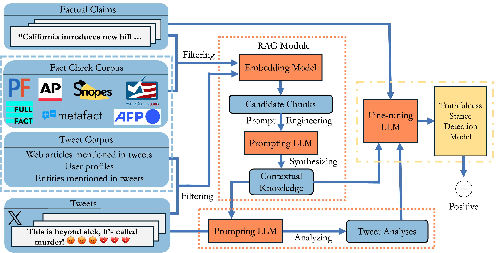

# RATSD: Retrieval Augmented Truthfulness Stance Detection from Social Media Posts Toward Factual Claims

This repository contains the code and data for the paper "RATSD: Retrieval Augmented Truthfulness Stance Detection from Social Media Posts Toward Factual Claims".

## Model Structure

The model structure is shown in the following figure:



## Datasets

### TSD-CT Dataset

The TSD-CT dataset is located in TSD-CT.json. It contains the following fields:

- **id**: Unique identifier for each annotation.
- **claim_author**: The author of the claim.
- **claim**: The factual claim being evaluated.
- **tweet**: The social media post related to the claim. (The content is removed to protect user privacy)
- **screening**: Indicates if the claim has been screened during annotation.
- **answered**: Indicates how many time the claim has been answered by annotators.
- **tweet_url_title**: The title of the URL included in the tweet.
- **claim_timestamp**: The timestamp when the claim was made.
- **tweet_timestamp**: The timestamp when the tweet was posted.
- **tweet_id**: Unique identifier for the tweet.
- **tweet_userhandle**: The user handle of the person who posted the tweet.
- **retweet_count**: Number of times the tweet has been retweeted.
- **reply_count**: Number of replies to the tweet.
- **like_count**: Number of likes the tweet has received.
- **quote_count**: Number of times the tweet has been quoted.
- **claim_source**: The source from which the claim originated.
- **claim_verdict**: The verdict on the claim (e.g., true, false).
- **factcheck_timestamp**: The timestamp when the fact-check was conducted.
- **claim_review_summary**: A summary of the fact-check review.
- **claim_review**: The detailed review of the claim.
- **factcheck_url**: URL to the fact-check article.
- **claim_tags**: Tags or categories associated with the claim.
- **claimbuster_score**: Score indicating the likelihood of the claim being false.
- **pair_id**: Identifier for the pair of claim and tweet.
- **factcheck_author_url**: URL to the author's profile who conducted the fact-check.
- **factcheck_post_time**: The time when the fact-check was posted.
- **factcheck_author_info**: Information about the author who conducted the fact-check.
- **subset**: The subset of the dataset to which the record belongs.
- **label**: The label assigned to the claim (e.g., positive - 1, neutral or no stance - 0, negative - -1, different topics - 2, problematic - 3).


There were 206 annotators, 30 were deemed high-quality based on our quality control approach. A total of 18,584 annotations were collected, with 13,594 from these high-quality annotators. This resulted in 3,105 completed pairs, containing 1,520 unique claims. Of the completed pairs, 1262 were labeled as "positive", 216 were labeled as "different topics" and 669 as "problematic." 

### Fact Check Corpus
We developed a tool to collect the fact-checks from seven well-known fact-checking websites, including [AFP Fact Check](https://factcheck.afp.com/), [AP Fact Check](https://apnews.com/ap-fact-check), [FactCheck.org](https://www.factcheck.org/), [FullFact](https://fullfact.org/), [Metafact](https://metafact.io/), [PolitiFact](https://www.politifact.com/), and [Snopes](https://www.snopes.com/).

The collected data is coded using [ClaimReview's data schema](https://schema.org/ClaimReview), a widely adopted standard for structuring fact-checks. The data schema includes fields such as Publisher, ClaimReviewed, Summary, Review, Verdict, Author, ClaimPublishedDate, FactcheckPublishedDate, ThumbnailURL, URL, and Tags. Particularly, the Summary field provides a summary of the fact-check, while the Review field contains the main body of the fact-checking article, including background information and the evidence supporting the verdict.

- Database Setup
``` sh
brew install postgresql
# create database named fact_checks in postgres
# script for creating tables
python factcheck_corpus/utils/db_util.py -c 1
# script for deleting tables
python factcheck_corpus/utils/db_util.py -d 1
# script for inserting historical data
python factcheck_corpus/utils/db_util.py -i 1
```

- Crontab Job Setup
``` sh
pip install requirement.txt
python factcheck_corpus/utils/db_util.py # create/delete table
crontab -e # create a daily running task
```

- Data Schema
  - Publisher: the origanization which publishes the factcheck
  - Claim: factual claim that may contains misinformation
  - Review Summary: the summary of detailed review provided by publisher
  - Review: the details of verdict and background context of factual claim
  - Verdict: the verdict provided from publisher
  - Author: the author of factual claim
  - Claim Published Date: the date when the factual claim published
  - factcheck Published Date: the date when the fact check published
  - Image Url: A thumbnail image relevant to the fact check
  - Factcheck Url: factcheck's url
  - Tags: the tags or categories of factual claim

|Data source   |Publisher|Claim |Summary|Review|Verdict|Author|Claim Published Date|Factcheck Published Date|Thumbnail Url|Url|Tags|
| -------------|---------|------|-------|------|-------|------|--------------------|------------------------|-------------|---|---|
| Politifact   | ✔️       | ✔️    |✔️      |✔️     |✔️      |✔️     |✔️                   |✔️                       |✔️            |✔️  | ✔️ |
| Snopes       | ✔️       | ✔️    |✔️      |✔️     |✔️      |✔️     |❌                   |✔️                       |✔️            |✔️  | ✔️ |
| Metafact.io  | ✔️       | ✔️    |❌     |✔️     |✔️      |✔️     |✔️                    |✔️                       |❌           |✔️  | ✔️ |
| Fullfact     | ✔️       | ✔️    |✔️      |✔️     |❌     |❌     |❌                   |✔️                       |✔️            |✔️  |✔️|
| Factcheck.afp| ✔️       |❌     |✔️      |✔️     |❌     |❌    |❌                   |✔️                       |✔️            |✔️  |✔️|
| Factcheck.org| ✔️       |❌     |✔️      |✔️     |❌     |✔️     |❌                   |✔️                       |✔️            |✔️  |✔️|
| Apnews       | ✔️       |✔️     |✔️       |✔️     |✔️     |✔️     |❌                   |✔️                       |❌            |✔️  |✔️|
| healthfeedback.org| ✔️  |✔️     |✔️       |✔️     |✔️     |✔️     |✔️                   |✔️                       |✔️            |✔️  |✔️|


### Other Benchmark Datasets
Other benchmark datasets can be downloaded from the following links:
1. [RumourEval](https://figshare.com/articles/dataset/RumourEval-2019_Dataset/8844430)
2. [COVIDLies](https://github.com/richlo01/covidLies/)
3. [WTWT 2020](https://github.com/cambridge-wtwt/acl2020-wtwt-tweets/)

## Experimental Setup

- Environment Setup
``` sh
pip install requirement.txt
```

### Training

- Basic Usage Example
Use a pretrained model from Hugging Face, specifying the model as {{model_name}} and the dataset as {{dataset_name}}:

``` sh
python model_zoo/stance_model_finetune.py -om {{model_name}} -d {{dataset_name}} -n {{new_model_name}}
```

- Custom Pretrained Model Example
To fine-tune a custom pretrained model stored locally in the model_zoo/models directory, specify it with -m:

``` sh
python model_zoo/stance_model_finetune.py -m {{local_model_name}} -d {{dataset_name}} -n {{new_model_name}}
```

- Specifying Batch Size and Epochs
Adjust the batch size and number of training epochs with -bs and -ep parameters:
    
``` sh
python model_zoo/stance_model_finetune.py -om {{model_name}} -d {{dataset_name}} -n {{new_model_name}} -bs {{batch_size}} -ep {{epochs}}
```

### Evaluation

- Basic Usage Example
Evaluate a pretrained model (either local or online) on the specified dataset using {{datasource}} and {{model_name}}:

``` sh
python model_zoo/model_evaluation.py -om {{model_name}} -d {{datasource}}
```

- Custom Pretrained Model Example
To evaluate a custom pretrained model stored locally in the model_zoo/models directory, specify the model name with -m:

``` sh
python model_zoo/model_evaluation.py -m {{local_model_name}} -d {{datasource}}
```

- Online Pretrained Model with Specific Dataset
Specify an online pretrained model with a particular dataset:

``` sh
python model_zoo/model_evaluation.py -om {{model_name}} -d {{datasource}}
```
